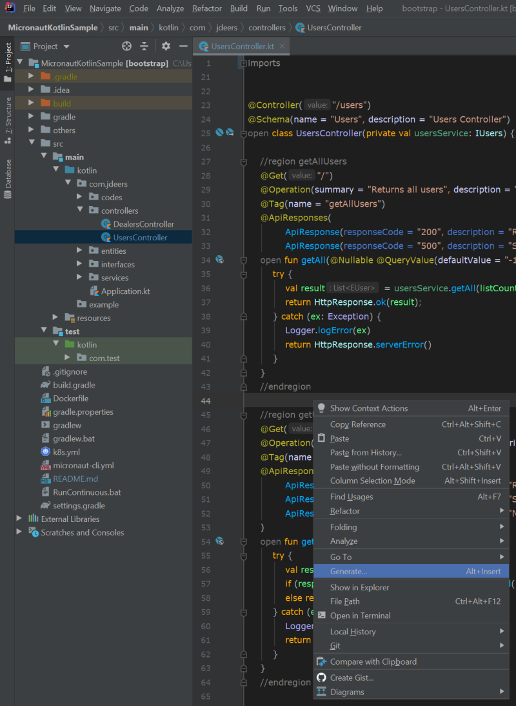
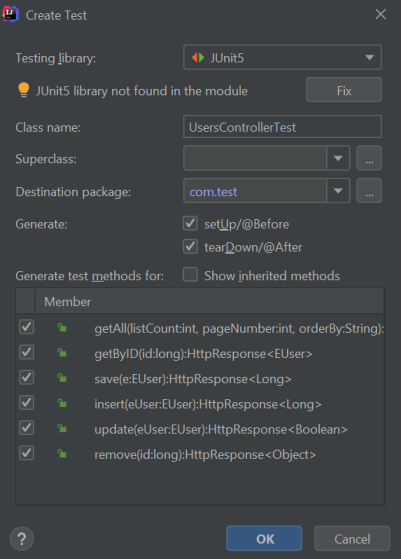
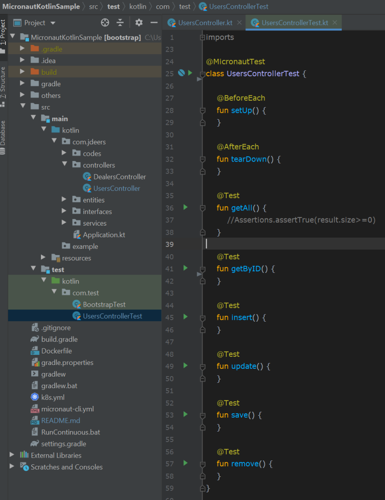

# Micronaut with Kotlin
Micronaut [Kotlin](https://kotlinlang.org/) sample project serving as a bootstrap base project for your own projects. This project uses [JPA](https://www.javatpoint.com/jpa-tutorial), [Hibernate](http://hibernate.org/), [Config4K](https://github.com/config4k/config4k), [TDD](https://en.wikipedia.org/wiki/Test-driven_development) with [JUnit5](https://micronaut-projects.github.io/micronaut-test/latest/guide/#junit5) and exposes the API through Swagger.

<!--toc generated automatically by running markdown-toc -i README.md-->

<!-- toc -->

- [Setup](#setup)
- [Live Reloading](#live-reloading)
- [Swagger](#swagger)
- [Tests](#tests)
- [PostgreSQL](#postgresql)
- [Docker](#docker)
- [Kubernetes](#kubernetes)
- [Gradle](#gradle)

<!-- tocstop -->

# Setup

* This project was generated by [Micronaut Launch](https://micronaut.io/launch/).
* Before running this project, create a PosgreSQL database generateb by pg_dump from [here](others/postgresql/postgresql.sql).
* If you want to test the REST Web APIs exposed by this project, import the [Postman](https://www.postman.com/) collection from [here](others/MicronautKotlinSample.postman_collection.json).

# Live Reloading

In case you wish to use Live Reloading to automatically recompile the project when code changes, just click on `run` or `debug` using the `Continuous` Configuration (created for this project) under IntelliJ, or simply execute in terminal: `RunContinuous.bat`. Wait until you see the line `Server Running: http://localhost:8080`. After that, you may call your Controllers from a client application. 

You may find the complete procedure on how to enable live reloading in a new Micronaut Kotlin project [here](https://github.com/micronaut-projects/micronaut-core/blob/master/src/main/docs/guide/cli/reloading/automaticRestart.adoc). 

Basically, you have to follow the steps below: 

1. You can create a project with file-watch feature: `mn create-app myapp --features file-watch` or, 
2. Add the following to your application.yml

```yaml
micronaut:
    io:
        watch:
            paths: src/main
            restart: true
```

3. Now, you can run your project by executing `./gradlew run --continuous` or you can open your gradle window in IntelliJ and create a configuration based on `run` task. Add `--continuous` as arguments to the run/debug configuration. 

# Swagger

This project exposes the swagger-ui and the OpenAPI yml. You can access the Swagger UI at http://localhost:8080/swagger-ui and the OpenAPI yml at http://localhost:8080/swagger/bootstrap-0.0.yml . 

# Tests

There are several [Testing Frameworks](https://micronaut-projects.github.io/micronaut-test/latest/guide/#introduction) that can be used to generate tests for your project, like Spock, JUnit, KotlinTest and Kotest. In this case, we are using JUnit 5. To add a test to a kotlin class, do the following: 

1. Open the kotlin class file you want to generate tests (Ex: UsersController.kt):
2. Right click your mouse under the text editor. The following screen will appear:



3. Click on Generate...

4. Click on Test... 

5. Select the methods and the destination package where you want to generate the tests as demonstrated below:



6. IntelliJ will create a test file similar to the file below:



7. Inject the service into the test class constructor and implement one function test as below:

```kotlin
@MicronautTest
internal class UsersServiceTest(private val usersService: IUsers) {
    @Test
    fun getAll() {
        val result= usersService.getAll()
        Assertions.assertTrue(result.size>=0)
    }
}
```

# PostgreSQL 

Prior to running your container, remember to change the ip address used to connect to your PostgreSQL in application.conf. If your postgresql is running in your local machine, you can enable remote connections by following the steps below:

1. Open `C:\Program Files\PostgreSQL\12\data\pg_hba.conf`

2. Add the line: `host    all             all             0.0.0.0/0            	md5`

3. Open `C:\Program Files\PostgreSQL\12\data\postgresql.conf`

4. Make sure you have the line: `listen_addresses = '*'`

# Docker

You can generate a docker image with the tag name you want by editing build.gradle. By default, the image generated is `micronaultsample:latest`, but you can change it in build.gradle:

```groovy
jib.to.image = 'micronautsample'
```

Execute `gradlew` to create the Docker image:

```bash
gradlew jibDockerBuild
```

Now you can execute your container:

```bash
docker run -d -p 8080:8080 --name mysample micronautsample
```

# Kubernetes

In case you wish to run this project inside Kubernetes, follow the steps below:

1. Execute `kubectl apply -f k8s.yml`. A [Deployment](https://kubernetes.io/docs/concepts/workloads/controllers/deployment/) and a [Load Balancer](https://kubernetes.io/docs/tasks/access-application-cluster/create-external-load-balancer/) will be created for the project. 
2. Execute `kubectl get pods` to check if it's running. 
3. Execute `kubectl delete -f k8s.yml` to delete the Deployment and Load Balancer. 

**NOTE**: Remember to remove or change the line `imagePullPolicy: Never ` inside `k8s.yml` in production. 

# Gradle

* Although Gradle Build Tool is not the main goal of this README, it might be useful to understand some basic concepts of [Gradle](https://gradle.org/), since you can do almost everything from command line instead of using IntelliJ, if you prefer.

* Commands: 

  `gradlew tasks`: Displays all gradle tasks available from command line

  `gradlew test`: Execute all tests in the project. This approach is great inside Jenkins, but you might prefer running through right click `test/kotlin` folder to verify all green/red badges presented by IDE while running the tests.
